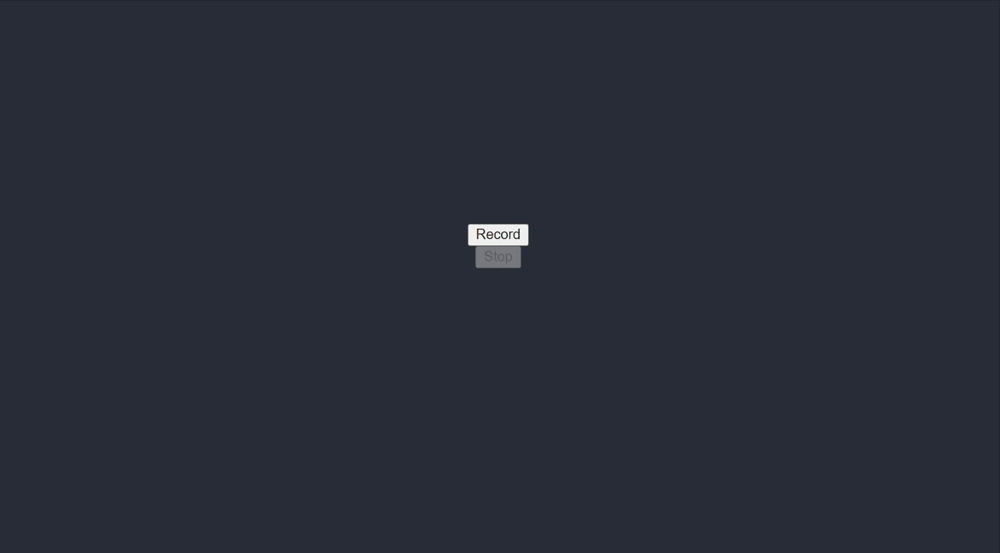

#  ReactJS-Spring-Boot-Full-Stack-App



This project consists of two applications: one is a Spring Boot Rest API called backend and another is a ReactJS application called frontend.


## Applications

- backend

Spring Boot Web Java backend application that exposes a REST API to handle a POST request from client-side and return the receieved audio file size as a response.  

backend does not stores any data in any kind of database in this case.


- frontend

ReactJS frontend application where users can record and save the recorded sounds. All the recorded sounds/voices will be automatically sent to backend where the uploaded file size is calculated. User can also see the size of the uploaded file on UI.

## Prerequisites

- Java 11+
- NodeJs v.16.13.1 /npm v.8.3.0
- Docker -v 20.10.21

## Installation

Clone the repository:

```bash
git clone https://github.com/Cch18/react_proj.git
```

Navigate to the newly created folder:

```bash
cd react_proj/
```

Start the application 

```bash
docker-compose -f docker-compose.yml up
```

Navigate to:

[http://localhost:8000](http://localhost:8000/)


##  Development server

**Frontend** -NodeJs.v.16.13.1 /npm v.8.3.0

Navigate to frontend subfolder:

```bash
cd frontend
```

Install the modules

```bash
npm i
```

Start the application on local host:

```bash
npm start
```

Navigate to:

[http://localhost:3000](http://localhost:3000/)

**Backend -** Install JDK 11.0.11 Install docker -v 20.10.21 Install docker-compose - v2.12.2

Navigate to frontend subfolder:

```bash
cd backend
```

Start the application on local host:

```bash
gradle bootrun
```

The backend will run on http://localhost:8080 

